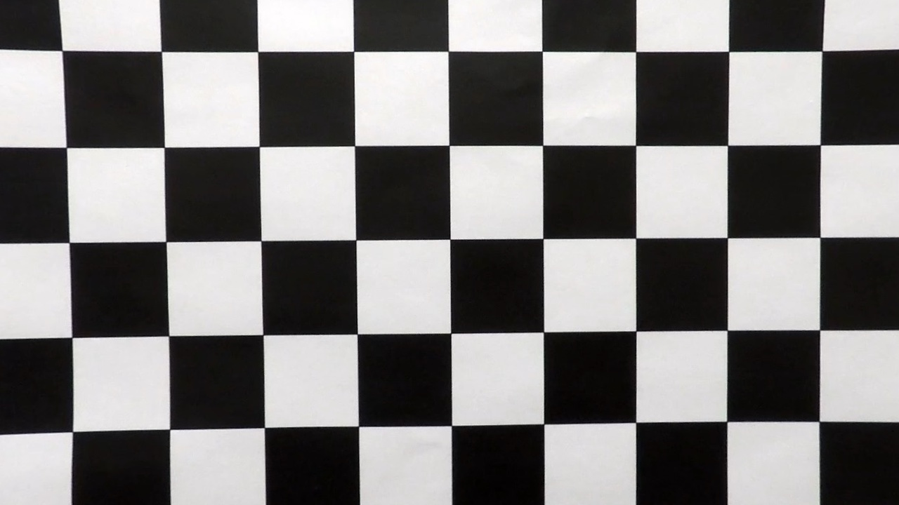
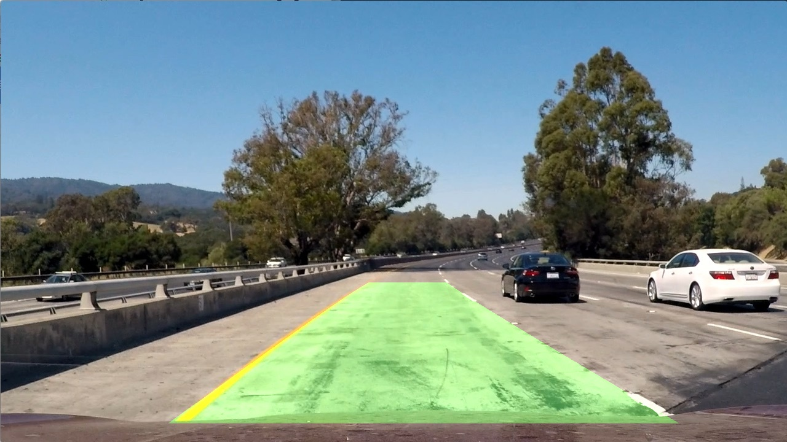

## Writeup
**Advanced Lane Finding Project**

I separated this project in two notebooks. The first one deals with defining the process to be applied to each image: [Advanced Lane Finding.ipynb](https://github.com/albertoferna/CarND-Advanced-Lane-Lines/blob/master/Advanced%20Lane%20Finding.ipynb)

In the second one I applied that procces to the videos: [Advanced Lane Finding.ipynb](https://github.com/albertoferna/CarND-Advanced-Lane-Lines/blob/master/Video%20Processing.ipynb)

Also, HTML static versions can be found in [github repository](https://github.com/albertoferna/CarND-Advanced-Lane-Lines)

The goals / steps of this project are the following:

* Compute the camera calibration matrix and distortion coefficients given a set of chessboard images.
* Apply a distortion correction to raw images.
* Use color transforms, gradients, etc., to create a thresholded binary image.
* Apply a perspective transform to rectify binary image ("birds-eye view").
* Detect lane pixels and fit to find the lane boundary.
* Determine the curvature of the lane and vehicle position with respect to center.
* Warp the detected lane boundaries back onto the original image.
* Output visual display of the lane boundaries and numerical estimation of lane curvature and vehicle position.

### Camera Calibration

Camera calibration is done in cells 2 and 3 of the first notebook. It is pretty much straight out of what was seen in class. The main difference is that the number of corner points change because the board is 6 by 9. Also, corner detecting fails in some images and that has to be accounted for when we loop over them.

In the end, we find a camera matrix and distortion coefficients that I print and save as a numpy array for later use.

#### Provide an example of a distortion-corrected image.

I check that distortion correction is working by applying it to calibration1.jpg. This is a closeup of the board and it should be easy to see it the correction is working fine. This is done in cell 5. The result can be see in:
 "Calibration Undistorted"

I also applied the same correction to one the test images as seen in cell 6.

### Thresholded binary image

To obtain a thresholded binary image I used both color transforms and gradient information. To get a sense of what information was on different channels, I plotted separately channels R, B, G, H, L, and S for image test1. I took that picture for testing as it is, together with test4 the hardest to get correctly from the basic video. This is done in cell 7.

#### Color Thresholding

Judging by the images, the most promising channels to use are red and saturation. I did several test on the thresholding values that seemed to work well for each channel. Given those thresholds, I filter any value outside that range while keeping values within. In this step I did not convert the image to a binary representation. This is done in cells 8 and 9. I took this approach because I wanted to combine the intensity values on each channel instead of doing a union or intersection of them. I wanted for each image to reinforce each other where lanes and detected. It seems to me a better way to make use of the information to apply a combined threshold afterwards as well as convert it to binary. To do that I had to normalize the sum of both images. That is done in cell 10.

#### Gradient Thresholding

I followed a very similar process with the gradients. I played for a while with threshold values to get a reasonable idea of what worked. After that, I applied the thresholding in the same way than for color, by filtering out values outside the thresholding range. This is done in cells 12 and 13.

I used the results from gradients as a sort of reinforcing mask. By combining the image obtained by color thresholding with both gradient images in a linear combination fashion we can make most of the non useful stuff disappear while maintaining the lane lines. To do that, I multiplied by some tested values each image and normalize the sum afterwards. Once that is done I applied a new threshold to the combination. This is done in cell 14.

This is one of the points that I think should require a more formal approach. I think that having a few images with the ground truth for this case and running a formal optimization over this parameters would help a lot in improving the detection capability.

After some trial and error testing I applied the procedure to all the testing images. Results can be seen as the output of cell 16. I also used that work to put together a function that taken an image would do all the steps up to a thresholded binary image, returning it.

### Perspective Transform

The idea here is to take an image that has been corrected for camera distortion and apply a perspective transform to it. To do that we first need some reference points.

The first step I take is in cell 17. I read in images in which the road is a straight line and I write them once they have been undistorted. The undistorting procedure is done with previously calculated camera matrix and distortion coefficients.

Next, I selected four points in straight_lines1_undistorded that define the lane lines, and thus our interest area. From the image it is sensible to assume that those points form a rectangle over the ground plane. Therefore, if we map those to a rectangle using a perspective transformation we should get the transformation we are after. To find the points in the image before warping I just went and measure them by hand. Those are the points represented in the array “src”. Destination points are selected to occupy a reasonable and centered part of the warped image. Those are points “dest”.  The transformation matrix and its invers are calculated on cell 18.

Once those matrices are calculated, I do a test warping reference image in cell 19. In the following cell compile the pipeline up to this point by creating a warped and thresholded image of on of the test frames.

### Finding Lanes and Fitting a Polynomial

I went about this part differently than it was proposed. From looking at the test images, is seemed reasonable that our pixels of interest are going to be on two bands. To find those, I started by finding the bottom end. I believe this is a more robust approach as the bottom area of the lane lines is usually clearer. This part is similar to what has been proposed in the lessons. For this I used an histogram. I divided the picture in left and right and I looked for the maximum of the histogram on each side. That point is from then on the bottom point of each lane line. This is done in cell 22.

Once I have those point, I mask the image with two vertical lines starting there. Those lines become a first approximation of the lane. Then, I setup a parameter that allows changing the width of that mask. Each masked area (one for right line and one for left line) is taken separately and a straight line is fitted on all white points. At this point we have improved our estimate of the lane to a straight segment inclined in the case of a curved segment of road. That is shown in cell 23.

The masking process is repeated with our updated estimate. This is done to improve the approximation of the area that we are going to account for in the fitting of our polynomial. Once that masking is done, I repeated the fitting process on the white pixels, but this time using a degree two polynomial. This is done in cell 24.

### Calculating Radius of Curvature and Position

With the polynomial calculated, finding the curvature is quite straight forward. The only step that requires care is converting our image from pixel space to real space. To do that, I simply took the size of the lane from the normative and scale it given our lane measurement in image pixels (lane_pixel_width). For the vertical scaling I used the approximated 30 meter measurement to the points in the image.

With the points now in real word measurements, I fitted again a degree two polynomial. From the values of that polynomial is just a matter of using formulae to calculate the radius of curvature. That is done in cell 25.

For the position I assumed that the camera is at the centerline of the car. By calculating the values of the previously fitted polynomial at the bottom of the picture (closest to the camera), we can find an estimate of how centered the camera, and the car, are. This is done in cell 26

### Plotted Results

In order to check the full pipeline, I applied all the steps to the images in the test directory.  To help with this, I put together a function that takes an image and returns the polynomial that fits the lane. That function “find_lane” is defined in cell 27. Drawing on top of those images is done by the function “plot_lane” defined in cell 28. Samples images from the test directory are saved in output_image with the name followed by result. This is one of those samples:
 "Test1 Results"

### Video Result

I wrote the pipeline for the video in a separate notebook. This time, with no need to explore alternatives, I organized the code to be applied in a video pipeline. The notebook is in my [github repository](https://github.com/albertoferna/CarND-Advanced-Lane-Lines) and it is called [Video Processing.ipynb](https://github.com/albertoferna/CarND-Advanced-Lane-Lines/blob/master/Video%20Processing.ipynb). In that repository video of the challenges can also be found.
The processed video can be found in this [link to my video result](./project_video_processed.mp4)

### Discussion

As I mentioned before, I think that detection could be improved by taken a more formal approach. My parameters work quite well in the project video. In fact, even if not frame to frame interpolation is done I was able to detect the lane. However, it does not work well with the challenge videos. I believe this could be improved notably by better tunning. Also, doing some treatment of the frames to increase contrast could be effective. Adding information from some other color space, such as HSV or LMS would also be beneficial.
